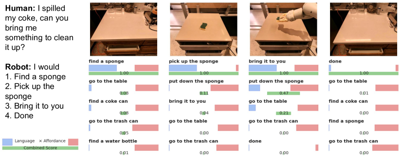
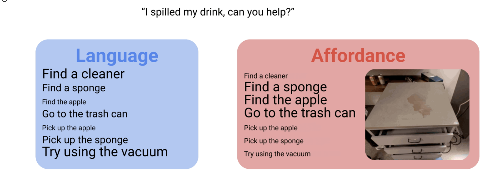
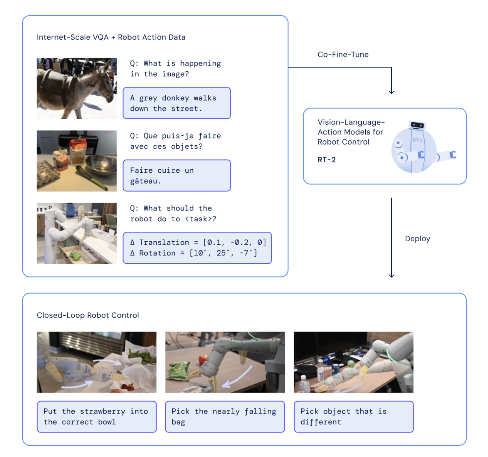
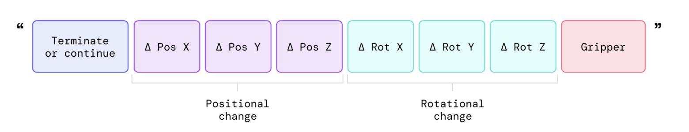
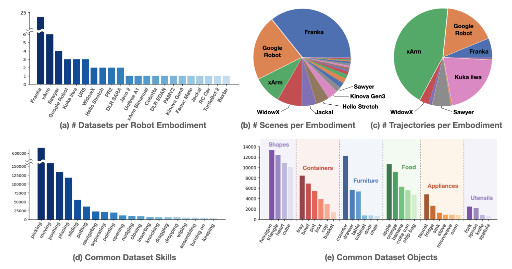

# Awesome-VLA-Robotics

[toc]

A list and my notes about VLA(Vision Language Model) on Robotics.  

The rapid development of multi-modal foundation models ([dinov2](https://ai.meta.com/blog/dino-v2-computer-vision-self-supervised-learning/), [sam2]( https://ai.meta.com/sam2/), [GPT-4o](https://openai.com/index/hello-gpt-4o/), [AnyGrasp](https://graspnet.net/anygrasp.html), etc.) has made great contribution in STEM area, including Robotics. More and more work utilize Language Model to enhance robot's ability. Although the basic executation ability(low level aspect) such as actuator and electicity is irrelevant, the perception and planning ability(high level aspect) such as sensing and long tasks arrangement can be highly improved by VLA.

Notice: VLA here is a big range containing LLM(Large Language Model), VLM(Vision Language Model), VLA(Vision Language Action), FM(Foundation Model), LVM(Large Vision Model), etc.

# List and Notes

Following are the list and my notes, containing the official website links and my understanding.

## SayCan, Do As I Can, Not As I Say:  Grounding Language in Robotic Affordances

* by Google Deepmind, 2022

* [[website](https://say-can.github.io)] | [[paper](https://say-can.github.io/assets/palm_saycan.pdf)] | [[code](https://github.com/google-research/google-research/tree/master/saycan)]
* The very first well-known project utilizing LLM to plan robot tasks. 
* Given a high-level instruction, SayCan combines **probabilities from a language model (representing the probability that a skill is useful for the instruction) with the probabilities from a value function (representing the probability of successfully executing said skill)** to select the skill to perform.

* Atomic/individual behaviors trained by BC or RL are capable of low-level visuomotor control. 
* A skill that is both useful and possible.

* TODO: what's the vision module of SayCan?

## RT-2: Vision-Language-Action Models: Transfer Web Knowledge to Robotic Control

* by Google Deepmind, 2023

* [[website](https://robotics-transformer2.github.io)] | [[paper](https://robotics-transformer2.github.io/assets/rt2.pdf)]
* A large vision-language model co-finetuned to output robot **actions** as natural language tokens. It represent robot actions as another language, which can be cast into text tokens and trained together with Internet-scale vision-language datasets.

* The robot data includes the current image, language command and the robot action at the particular time step.

* Developed from previous [RT-1](https://robotics-transformer1.github.io)(an efficient Transformer-based architecture designed for robotic control) and PaLM-E(LLM with web scale knowledge). RT-2 is a great work using VLA in robotics. Later we have [Open-X Embodiment](https://robotics-transformer-x.github.io) project and RT-X dataset.

From SayCan and RT-2 on, many excellent work using VLA appear in robot learning, manipulation and perception. For example, in Stanford, Feifei Li's lab has proposed lots of work about vision and spatial intelligence in robotics manipulation tasks. Here are some:

## VoxPoser: Composable 3D Value Maps for Robotic Manipulation with Language Models

* by Wenlong Huang et al., CoRL 2023 (Oral)

* [[website](https://voxposer.github.io)] | [[paper](https://arxiv.org/abs/2307.05973)] | [[code](https://github.com/huangwl18/VoxPoser)]
* Label affordances and constraints in 3D perceptual space for zero-shot robot manipulation in the real world.
* TODO:more details

## ReKep: Spatio-Temporal Reasoning of Relational Keypoint Constraints for Robotic Manipulation

* by Wenlong Huang et al., CoRL 2024 (Best Paper)

* [[website](https://rekep-robot.github.io)] | [[paper](https://arxiv.org/abs/2409.01652)] | [[code](https://github.com/huangwl18/ReKep)]
* Using LVM(dinov2 and sam2), combined with VLM(GPT-4o) to percept semantic and vision input, generate constraint, **finally plan tasks for robot manipulation**.
* The constraints are: 1. candidate keypoint for grasping and moving target. 2. sub-goal constraint for multi-tasks 3. path constraint for space-varying and pose-demanding tasks
* The official github repo has a simulation version using OmniGibison, a platform from Isaac Sim. It doesn't have a complete version for real world implement. But many modules(vision ability to get keypoint, path constraint, sub-goal devision, etc.) are meaningful.

TODO: COPA, MOKA

# Recommended Resource
1. Springer Handbook of Robotics, 2nd 2016  
Details knowledge of many aspects of robotics. Although published in 2016, most contents are still not outdated, helping you build up basic understanding and wide-range horizon of robotics. Use it as wikipedia by utilizing the content page and Ctrl+F function

---
# TODO: 

1. Diffusion Policy, Cheng-Chi, Diffusion model on Robotics.
2. Small Language Model/Edge AI/On-Device Intelligence + Robotics
3. What about the middle layers(locomotion, manipulation)? What is the deviding principle.
4. Learning-based and Model-based in motion planning and control field.the RL-based method is having more and more attention than traditional dynamics and kinematic model based control method.

# Contributing

Feel free to share your recommendation and thinking via PR or Issues.

